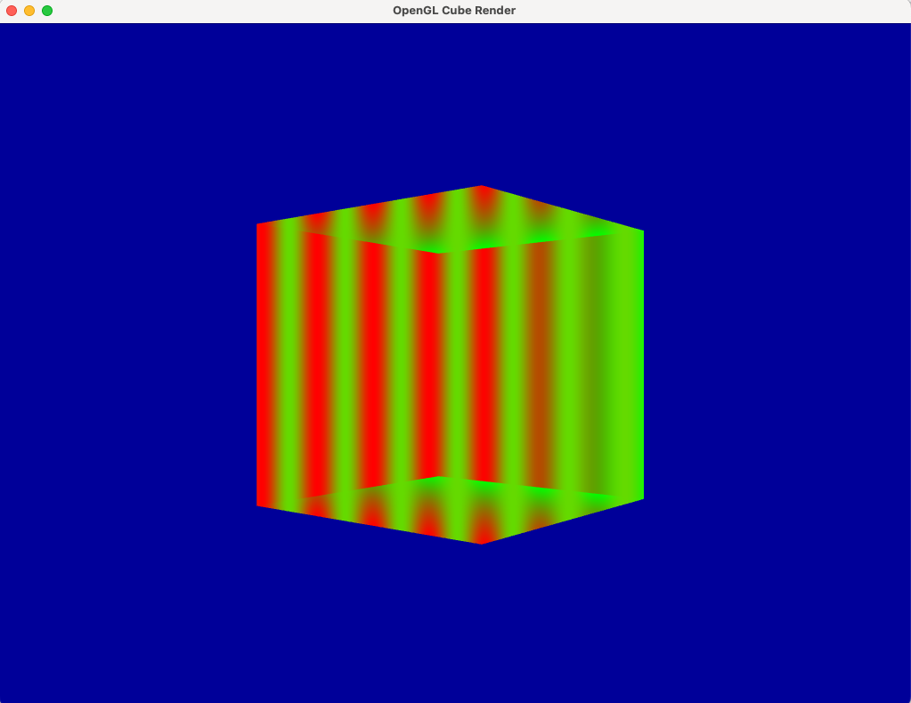

# Render a 3D cube using OpenGL

## Description

The camera in this demo is locked to look at the cube's center. This prevents the camera from moving such that it is not looking at the cube.

## Key Mappings

| Key           | Description                       |
|---------------|-----------------------------------|
| `Up Arrow`    | Rotate the cube upwards           |
| `Down Arrow`  | Rotate the cube downwards         |
| `Left Arrow`  | Rotate the cube towards the left  |
| `Right Arrow` | Rotate the cube towards the right |
| `Q`           | Zoom camera view in               |
| `E`           | Zoom camera view out              |
| `HOME`        | Reset camera's view to default    |
| `Esc`         | Close the window                  |
| `W`           | Move the camera forward           |
| `S`           | Move the camera backward          |
| `` ` ``       | Toggle wireframe mode             |

## Third Party OpenGL Dependencies Used

- [GLFW](https://www.glfw.org/download.html)
- [GLAD](https://glad.dav1d.de)
- [GLM](https://github.com/g-truc/glm)
